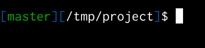
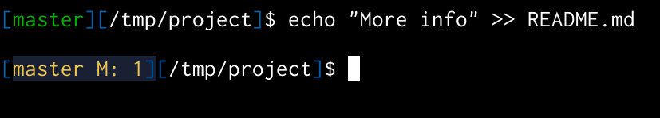
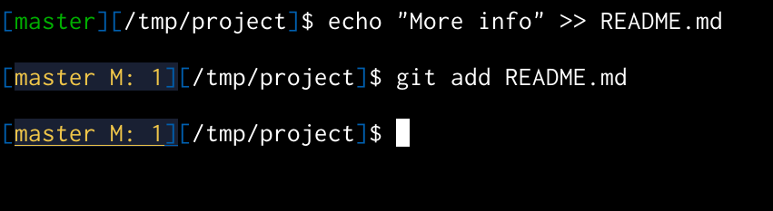
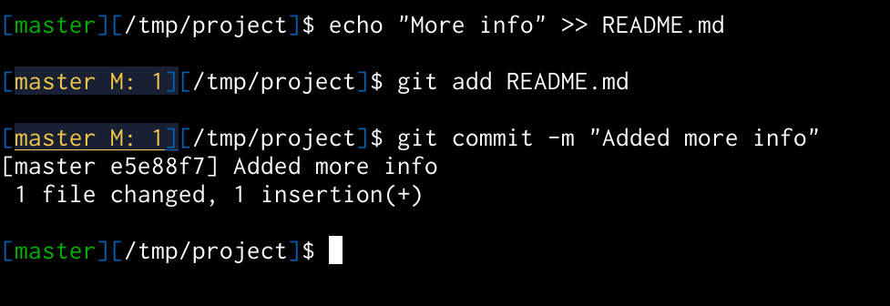
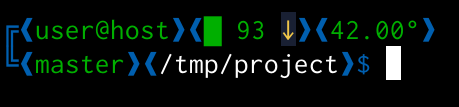
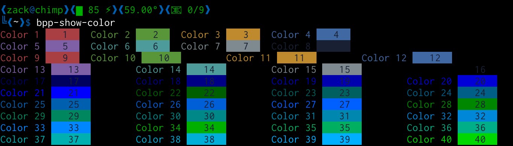
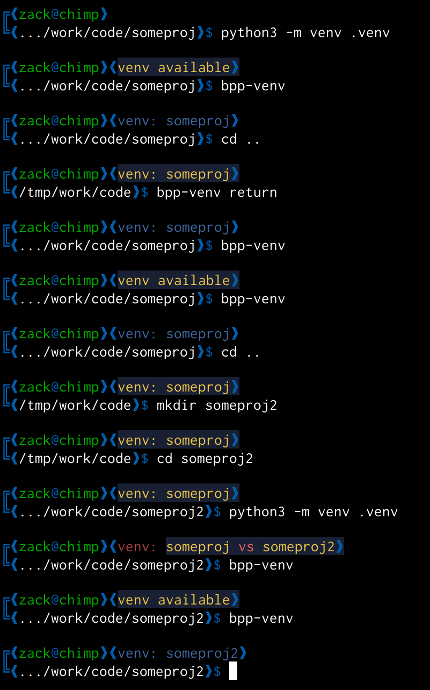
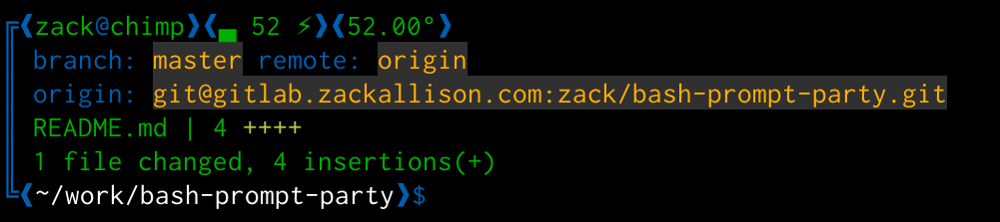

# Bash Prompt Package

Bash prompt customization made easy!

[Examples](#examples)

[Built In Example Prompts](#built-in-prompts)

[All Functions](#all-functions)

[More Info](#more-info)

---

Try out some prompt, just download `bash-prompt-package.sh` and load it with `source`.

Try `bpp-simple-prompt`, `bpp-compact-prompt`, `bpp-fancy-prompt`, and `bpp-super-git-promt` for some inspiration.

Also `bpp-show-color [columns]` will show the colors available to you.

If you can't remember what your prompt is you can see it with `bpp-show-prompt`.

---

## Examples

how about some examples?

---

Here's a simple example,showing just the VCS (git or svn) status, as well as "\w", the current working directory.

	source bash-prompt-package.sh

	BPP=(
	"CMD bpp_vcs"
	"STRDEC \w"
	"STR $ ")

After modifying a file you can see the status change

Staging the files changes the status

As does comitting it!

---

Here's a two line prompt showing uptime, battery, and cpu temp information on top, with VCS (git, svn, etc) and the current path..  The config looks something like

	source bash-prompt-package.sh

	BPP=("CMD bpp_error"
		 "STR ${BPP_GLYPHS[NEWLINE]}${BPP_COLOR[DECORATION]}${BPP_GLYPHS[TOP]} "
		 "CMD bpp_user_and_host"
		 "CMD bpp_uptime"
		 "CMD bpp_acpi"
		 "CMD bpp_cpu_temp"
		 "CMD bpp_text mytask"
		 "CMDRAW bpp_notes"
		 "STR ${BPP_GLYPHS[NEWLINE]}${BPP_COLOR[DECORATION]}${BPP_GLYPHS[BOTTOM]}${BPP_COLOR[RESET]}"
		 "CMD bpp_vcs"
		 "STR ${BPP_COLOR[DECORATION]}${BPP_GLYPHS[OPEN]}${BPP_COLOR[RESET]}\w${BPP_COLOR[DECORATION]}${BPP_GLYPHS[CLOSE]}\$");
	 bpp-text "Report bugs" mytask

---

Changing colors is easy too:

	BPP_COLOR[GOOD]=${BPP_COLOR[PURPLE]}
	BPP_COLOR[WARNING]=${BPP_BGCOLOR[BRIGHTRED]}${BPP_COLOR[BLACK]}
	BPP_COLOR[CRIT]=${BPP_BGCOLOR[BRIGHTRED]}${BPP_COLOR[WHITE]}

256 colors to choose from!  Which 256 is up to your terminal emulator.  See which are available using `bpp-show-colors`

---

Other modules include `bpp_uptime` and `bpp_date`

The `bpp_venv` modules is really handy for python virtual environment.  Use the command `bpp-venv` to quickly activate, deactive, or return to the root directory.  It also warns you when you change into a directory with a different virtual env, as seen below.

---

----

There are some commands that don't add anything to the prompt but are still useful, these are called by `EXE` instead of `CMD`.

`bpp_set_title` (e.g. `"EXE bpp_set_title"`) will print the escape sequence to set the title of an xterm.

`bpp_send_emacs_path_info` - will print the escape sequence to tell emacs ansti-term the path info.

`bpp_history` - Write your history and reload it to sync history from all terms

---

## Built In Prompts

`bpp-simple-prompt` - As basic as it gets

`bpp-compact-prompt`- For when you have limited space and need limited info

`bpp-fancy-prompt`- A nice daily driver

`bpp-super-git-prompt` - More git info than you'll ever need!

## All Functions - Alphabetical

`bpp_acpi`- Battery info

`bpp_cpu_temp` - A simple average of CPU core temps.  It "works for me™".  Needs a rewrite to work in more cases (e.g. with lm-sensors, etc)

`bpp_date` - Show the current date and/or time, according to `BPP_DATE_FORMAT`

`bpp_dirinfo` - Information about the current directory, number of files, and directory (non-recursive0 size.  Slow on remove file systems

`bpp_error` - Shows the error status of the last command

`bpp_history` - Share history among terminals. (history -a ; history -p)

`bpp_note` - Show a note for a given directory.  Set notes with `bpp-note "message" <dir>`.  If no dir is given pwd is used.  The option BPP_OPTIONS[NOTE_ON_ENTRY] gives you the option to only show when you enter the diretory, instead of whenever you're in the dir.

`bpp_send_emacs_path_info` - Send the current path info to emacs in ansi-term, allowing TRAMP to easily make connections

`bpp_set_title` - Send the escape sequence to set the title for xterm, screen, tmux etc.

`bpp_text <id>` - Show the text value id, set with `bpp-text "some message" myid` unset with `bpp-untext myid`, or by set the variable diretly at BPP_NOTES[id]. **ESCAPED VARIABLES WILL BE EVALUATED**, e.g: `bpp-text "host: \$DOCKER_HOST"` will eval DOCKER_HOST on display  It is colored with BPP_COLOR[INFO].

`bpp_uptime` - Show and colorize uptime values

`bpp_user_and_host` - Show and colorize user@host (e.g. yellow for remote hosts, red if you're root)

`bpp_vcs` - Show git or svn status information in a compact manner

`bpp_venv` - Python virtual environment variable options.  Use `bpp-venv` to activate, disactive, or return.

## More Info

Most functions will degrade gracefully, and can be controlled by environment variables.  For example to turn off display of the "date" module try `export BPP_DATE=0`

Each element is run through a "decorator" function, the built in one simple surronds the text with "❰" and "❱".  I'm sure someone out there can find a better use.

Check the [source code](bash-prompt-package.sh) of the [functions](#all-functions) for examples on how to write your own.  But if you can write bash, they're super easy!

Example:

	function bpp_date {
		if [[ ${BPP_ENABLED[DATE]} == 1 ]]; then
			echo "${BPP_COLOR[INFO]}$(date +${BPP_DATE_FORMAT})"
		fi
	}
